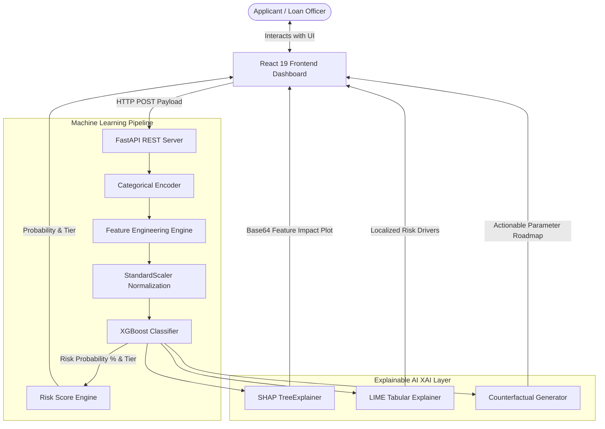

# 🏦 Machine Learning-Driven Credit Risk Prediction with Explainable Decision Support

[](https://reactjs.org/)
[](https://fastapi.tiangolo.com/)
[](https://xgboost.readthedocs.io/)
[](https://shap.readthedocs.io/)
[](https://tailwindcss.com/)
[](LICENSE)

An intelligent, end-to-end credit risk assessment system built as a **Final Year Engineering Project**. This platform evaluates loan applicant financial profiles and delivers transparent **Explainable AI (XAI)** decision support using **XGBoost**, **SHAP**, **LIME**, and **Prescriptive Counterfactual Analysis**.

---

## 🌟 Live Demo & Project Links

- 🚀 **Live Demo**: [https://premkumar3406.github.io/credit-risk-prediction](https://premkumar3406.github.io/credit-risk-prediction)
- 📦 **GitHub Repository**: [https://github.com/Premkumar3406/credit-risk-prediction](https://github.com/Premkumar3406/credit-risk-prediction)
- 👨‍🎓 **Author**: Prem Kumar ([@Premkumar3406](https://github.com/Premkumar3406))
- ✉️ **Contact Email**: [pesalapremkumar@gmail.com](mailto:pesalapremkumar@gmail.com)

---

## 📌 Abstract & Motivation

Traditional credit scoring models rely heavily on black-box machine learning algorithms. While highly accurate, their lack of transparency presents significant challenges for financial institutions due to strict regulatory compliance standards (e.g., **GDPR Right to Explanation**, **Fair Credit Reporting Act**). 

This project bridges the gap between **High Predictive Accuracy** and **Human-Understandable Interpretability** by offering:
1. **Accurate Default Probability Scoring** using Gradient Boosted Decision Trees (XGBoost).
2. **Global & Local Explainability** powered by SHAP (SHapley Additive exPlanations) and LIME (Local Interpretable Model-agnostic Explanations).
3. **Prescriptive Guidance** via Counterfactual Analysis, giving rejected or high-risk applicants an actionable roadmap to qualify for credit.

---

## 🚀 Key System Features

- ⚡ **Real-Time Credit Risk Scoring**: Computes exact loan default probability (%) and assigns applicants to **Low Risk**, **Medium Risk**, or **High Risk** tiers.
- 📊 **SHAP Global Feature Importance**: Visualizes tree-based feature weights showing overall model behavior.
- 🔬 **LIME Localized Factor Attribution**: Extracts top localized financial factors driving individual approval or risk flags.
- 🎯 **Prescriptive Counterfactual Roadmap**: Computes actionable target modifications (e.g., target loan reduction, income threshold, interest rate target).
- 💼 **Dynamic Financial KPI Benchmarks**: Real-time evaluation of Debt-to-Income (DTI %), Monthly EMI Repayment Burden, Income Stability, and Credit Exposure metrics.
- 🎨 **Modern Glassmorphism Dashboard UI**: Built with React 19, Tailwind CSS, Lucide icons, and optimized typography (`Plus Jakarta Sans`).
- 📦 **Unified & Microservice Serving Modes**: Supports standalone React dev execution alongside a unified single-port FastAPI deployment (`http://127.0.0.1:8000`).

---

## 📐 System Architecture



---

## 🔬 Technical Methodology & Feature Engineering

### 1. Engineered Financial Indicators
- **Debt-to-Income (DTI)**: $\text{DTI} = \frac{\text{Loan Amount}}{\text{Annual Income} + 1}$
- **EMI Repayment Burden**: $\text{EMI Burden} = \frac{\text{Loan Amount} \times \text{Interest Rate}}{12 \times (\text{Annual Income} + 1)}$
- **Income Stability Index**: $\text{Stability} = \frac{\text{Employment Length}}{\text{Age} + 1}$
- **Overall Credit Exposure**: $\text{Exposure} = \text{Loan Amount} \times \text{DTI}$

### 2. Machine Learning Model
- **Algorithm**: XGBoost Classifier (Gradient Boosted Trees)
- **Preprocessing**: StandardScaler normalization, One-Hot / Label encoding for categorical variables (`person_home_ownership`, `loan_intent`, `cb_person_default_on_file`).

### 3. Explainable AI (XAI) Integration
- **SHAP**: Computes Shapley values from cooperative game theory to quantify exact positive and negative contributions of each financial attribute.
- **LIME**: Fits a localized interpretable linear model around the specific applicant instance to explain individual predictions.
- **Counterfactual Reasoning**: Iteratively computes minimum necessary profile changes to transition high/medium risk profiles into low risk qualification tiers.

---

## 🛠️ Technology Stack

| Layer | Technologies & Frameworks |
| :--- | :--- |
| **Frontend UI** | React 19, Tailwind CSS, Lucide React Icons, Fetch API |
| **Backend REST API** | FastAPI, Uvicorn, Pydantic, Python 3.12 |
| **Machine Learning** | XGBoost, Scikit-Learn, Pandas, NumPy, Joblib |
| **Explainable AI (XAI)** | SHAP (TreeExplainer), LIME (LimeTabularExplainer) |
| **Deployment** | GitHub Pages (Frontend), FastAPI Static Mounting (Unified Production) |

---

## 🔌 REST API Reference

| Endpoint | Method | Input Payload | Description |
| :--- | :--- | :--- | :--- |
| `/health` | `GET` | None | API health status check |
| `/predict` | `POST` | `InputData` JSON | Returns default probability (%) and assigned risk level |
| `/shap` | `POST` | `InputData` JSON | Generates and returns Base64 encoded SHAP feature plot |
| `/lime` | `POST` | `InputData` JSON | Returns top localized risk factors |
| `/counterfactual` | `POST` | `InputData` JSON | Returns actionable parameter adjustments for risk reduction |

---

## 💻 Local Setup & Execution Guide

### Prerequisites
- **Python 3.10+**
- **Node.js 18+** & `npm`

### 1. Clone Repository
```bash
git clone https://github.com/Premkumar3406/credit-risk-prediction.git
cd credit-risk-prediction
```

### 2. Backend Setup (FastAPI)
```bash
cd backend
python -m venv venv
.\venv\Scripts\activate      # Windows
# source venv/bin/activate  # Linux/macOS

pip install -r requirements.txt
python -m uvicorn app:app --host 0.0.0.0 --port 8000
```
- **Unified Application**: `http://127.0.0.1:8000`
- **Interactive Swagger API Docs**: `http://127.0.0.1:8000/docs`

### 3. Frontend Setup (React - Dev Mode)
```bash
cd frontend
npm install
npm start
```
- **React Dev Server**: `http://localhost:3000`

---

## 📄 License & Credits

This project is open-source under the **MIT License**.

Developed as a Final Year Engineering Project by **Prem Kumar** ([pesalapremkumar@gmail.com](mailto:pesalapremkumar@gmail.com)).
