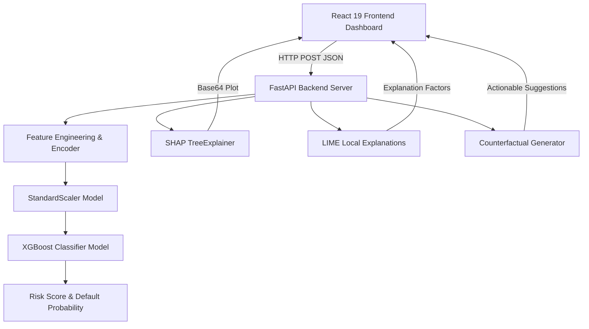

# 🏦 Credit Risk Assessment & Explainability Dashboard

[](https://reactjs.org/)
[](https://fastapi.tiangolo.com/)
[](https://xgboost.readthedocs.io/)
[](https://tailwindcss.com/)
[](LICENSE)

An intelligent, end-to-end credit risk assessment system that evaluates applicant financial profiles and generates **Explainable AI (XAI)** insights using **SHAP**, **LIME**, and **Counterfactual Analysis**.

---

## 🌟 Live Demo & Repository
- **GitHub Repository**: [github.com/premkumar3406/credit-risk-prediction](https://github.com/premkumar3406/credit-risk-prediction)
- **Author**: Prem Kumar ([@premkumar3406](https://github.com/premkumar3406))
- **Email**: pesalapremkumar@gmail.com

---

## 🚀 Key Features

- **⚡ Real-time Credit Risk Prediction**: Evaluates applicant parameters and outputs default probability (%) and risk tier (**Low Risk**, **Medium Risk**, **High Risk**).
- **📊 SHAP Feature Importance**: Generates bar charts illustrating global feature impact on credit decisions.
- **🔬 LIME Local Explanations**: Identifies the top 5 localized positive/negative factors influencing individual applicant outcomes.
- **🎯 Counterfactual Roadmap**: Computes actionable parameter adjustments to help high/medium risk applicants qualify for credit.
- **💼 Interactive Financial KPIs**: Calculates Debt-to-Income (DTI %), Monthly EMI Repayment Burden, and Credit Exposure index dynamically.
- **🎨 Modern Glassmorphism UI**: Built with React 19, Tailwind CSS, Google Fonts (`Plus Jakarta Sans`), and Lucide icons.

---

## 📐 Architecture Overview



---

## 🛠️ Technology Stack

| Layer | Technologies Used |
| :--- | :--- |
| **Frontend** | React 19, Tailwind CSS, Lucide Icons, Fetch API |
| **Backend** | FastAPI, Uvicorn, Pydantic, Python 3.12 |
| **Machine Learning** | XGBoost, Scikit-Learn, Pandas, NumPy, Joblib |
| **Explainable AI** | SHAP (SHapley Additive exPlanations), LIME Tabular Explainer |

---

## 🔌 API Endpoints Reference

| Endpoint | Method | Description |
| :--- | :--- | :--- |
| `/` | `GET` | API Health Check |
| `/predict` | `POST` | Returns default probability & risk level classification |
| `/shap` | `POST` | Returns Base64-encoded SHAP feature importance plot |
| `/lime` | `POST` | Returns top 5 LIME local factor explanations |
| `/counterfactual` | `POST` | Returns actionable counterfactual suggestions for risk reduction |

---

## 💻 Local Setup & Execution Guide

### Prerequisites
- **Python 3.10+**
- **Node.js 18+** & `npm`

### 1. Run Backend Server (FastAPI)
```bash
# Navigate to backend directory
cd backend

# Activate Virtual Environment (Windows)
.\venv\Scripts\activate

# Install dependencies if needed
pip install -r requirements.txt

# Start FastAPI server on port 8000
python -m uvicorn app:app --host 127.0.0.1 --port 8000
```
Backend will run at: `http://127.0.0.1:8000` (Docs: `http://127.0.0.1:8000/docs`)

### 2. Run Frontend Web App (React)
```bash
# Open a new terminal and navigate to frontend directory
cd frontend

# Install npm dependencies (if not already installed)
npm install

# Start React development server
npm start
```
Frontend Web UI will open at: `http://localhost:3000`

---

## 📄 License
This project is licensed under the MIT License - see the [LICENSE](LICENSE) file for details.

Developed with ❤️ by **Prem Kumar** ([pesalapremkumar@gmail.com](mailto:pesalapremkumar@gmail.com)).
